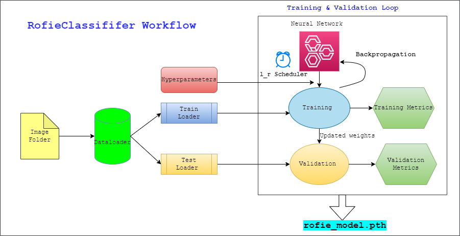

# Rofieclassifier 🛤 ⛰
Rofieclassifier is a binary CNN classifier designed to classify roads and fields. It leverages Convolutional Neural Networks to train on a substantial dataset from the "data" folder. The trained model can then be used for inference and testing, and the package saves essential data, including plots and the model state dictionary with main training parameters.
## Cloning the Repository:

To import the "rofieclassifier" repository on your local machine, follow these steps:

1. Open a terminal or command prompt in your desired workspace folder.
2. Clone the repository using the following command:
   ```bash
   git clone https://github.com/salim19a/Rofieclassifier.git

3. Change directory to the folder rofieclassifier where we will be working 
   ```bash
   cd rofieclassifier
4. Install the resuired packages 
   ```bash
   pip install -r requirements.txt

    ```
 
## Repository Structure:
The "**Rofieclassifier**" repository is organized as follows:
- data0 : The original provided dataset for training and test, split into train (80%), validation(20%) and kept the test images (10) for test.
- data:  The augmented dataset contains approximately 155 images for each class and follows the same folder structure as data0.

- rofieclassifier: The main package containing the following subdirectories:

   - **bin** : This directory houses the running scripts for training and testing the classifier.

   - **model**: Here, we define the structure of the CNN model called "Rofie()" and implement the function "save_model" to save checkpoints during training.

   - **utils**: This directory contains general utilities essential for the package's smooth functioning, such as file checking, plot saving, and data loading.

   - **dataset.yaml** : A YAML file specifying the paths to the data for training, validation, and testing.

⚠️ If you have data located elsewhere, please make sure to update the content of this file accordingly. Make sure you have the necessary data stored in the directories specified in the "dataset.yaml" file or update the file to match your data location.
        - For training: Replace `../data/train` with the path to your training data.
       - For validation: Replace `../data/validation` with the path to your validation data.
        - For testing: Replace `../data/test` with the path to your testing data.
    - **requirements.txt** : list of the required packages to be installed
   - We have also Added the report of the project Task1: Technical Exercice , and the Paper Summary of  Task2 : Paper Review
## Rofie() General Framework 

## Training 

Before delving into training, it's important to transform our data, to do this we structure our data folder as following : 
 Data **train**/  [ road -field ] **validation**/  [ road -field ]**test**/ [ road -field ]
It's important ta structure your folder as above, the Datalaoder can understand thereby the label of images : road or field .

Let's Start training 🧠📚:

run the following command on a terminal :
```bash
   python  bin/train.py  --output_dir OUPUT_DIR --data DATA --batch BATCH --epochs EPOCH --save_model --imgsize IMGSIZE --saveperiods SAVEPERIODS --lr LR
 ```
Where:

 * OUTPUT_DIR: The name of the output directory where plots and the trained model will be saved at the end of training.
 * DATA: The path to your dataset.yaml file. Make sure it's inside the current directory (rofieclassifier), no matter where you run the command.
 * BATCH: The batch size for training (e.g., 4, 8, 16, 32, ...).
* EPOCH: The total number of training epochs (e.g., 30, 60, 100, ...).
 * IMGSIZE: During training, images are loaded and resized to IMGSIZE for uniformity. A preferred image size will be a multiple of the stride 32, but you can choose any size you like, and the algorithm will adapt accordingly.
 * SAVEPERIODS: If provided, training checkpoints will be saved in the OUTPUT_DIR. This is important for resuming training or selecting the best model based on validation performance.
* LR: The starting learning rate, initialized with 3e-4. The package includes a learning rate scheduler that adapts its value during training, so you don't need to worry too much about this parameter.

Make sure to tune hperparameters to avoid memory loading and overfitting ! 

## Testing / Inference

To perform inference on a single image or a folder containing "road" and "field" subfolders, run the following command in the terminal:
```bash
python  bin/test.py  --model_path  MODELPATH --data DATA 
```
Where : 
* MODELPATH: The path to the model saved from the training process. The default value is model_rofie.pth, and it's stored by default in the output folder.
* DATA: This can be one of the following:
   * A single image (e.g., .png, .jpeg): In this case, the image is plotted with a title displaying the prediction label (either "road" or "field").
   * A folder path: In this case, all images within the folder are displayed, and each image is titled with both the real label and the predicted label.
⚠️ Please ensure that your folder contains subfolders named "field" and "road" so that true labels are known.
   * The path to the dataset.yaml file: In this case, we test the accuracy of the test images whose paths are provided in the dataset.yaml (../data/test). The images inside the test dataset are plotted, and each image is titled with its corresponding prediction.

Note that all  hyperparameters, including image size, are preserved within the model dictionary, so you don't have to specify them separately.

## Accessing Pre-trained Models

As the training models (.pth files) are sizeful, we couldn't include them in the Git repository. Instead, we provide an external drive link where you can download them. In this link, you can find weights for both the first training based on the original data (data0) and the enhanced one based on the augmented data, enabling you to compare their performance.

**[Click here to access the pre-trained models](https://drive.google.com/drive/folders/1GD9bsnjTas5CN_0yAqXliEkKOur3tyKK?usp=sharing)**

Download the model weights from the provided link and save them in the appropriate location to utilize them for inference or further experimentation with the "rofieclassifier" folder.

## Link to the overleaf Assignement report
**[Click here to access the Assignement detailed report](https://www.overleaf.com/read/ymvhzwnjghvn)**
